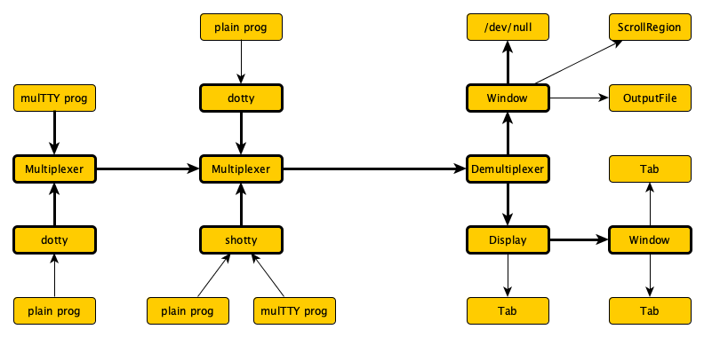

# MulTTY to support Containers and Graphical Interaction

> *This is an exploration of how classical TTY
> interfaces can be improved to reflect modern
> changes to our computing environments.*

Computer technicians spend a lot of time on consoles.
This includes hardware interfaces, server management but
also more and more interaction with containers.

TTYs are as modern as they have every been, but very
little effort has gone into upgrading their functionality.

This project proposes to add **multiplexing** to console
interfaces, so we can keep streams separate until the
places where they are rendered.  There should be no
problem running many processes over one interface and
splitting them somewhere else.

For **containers** it is tremendously useful to export
their programs' interfaces over more than a single
thin TTY line, without having to add much complexity
in the containers themselves; multiplexing is a simple
ASCII discipline that delegates the actual rendering,
session management and so on to the container's host.

We propse to enable **remote control** by having an extra
input stream `stdctl` for interactive commands.  This may
be used to start, pause, resume, stop and perhaps kill a
program; it may also be considered for dynamic changes to
the configuration of a program.

We also propose **structuring text** by creating streams
with a clear interpretation based on ASCII control codes
that we currently don't use.  A good example of this is
an integration with SASL authentication, but much more
could be possible, up to even structuring the entire
interaction with a program.

A last thing proposed here, is to **use SCTP** as a carrier
for consoles.  Multiplexin works well over TCP, but it
can be much simpler over SCTP.  It's optional but highly
recommended.

